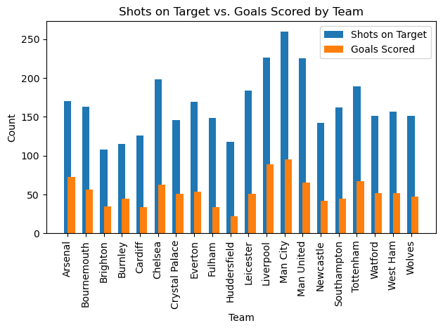

# PROJECT ENGLISH SOCCER 

  

-----

## DATASET :file_folder:
le dataset contient les donnes suivants : 

|    | Div   | Date                | HomeTeam     | AwayTeam       |   FTHG |   FTAG | FTR   |   HTHG |   HTAG | HTR   | Referee    |   HS |   AS |   HST |   AST |   HF |   AF |   HC |   AC |   HY |   AY |   HR |   AR |   GoalToShotRatio |   Week |   TotalShots |   GoalsToShotsRatio |
|---:|:------|:--------------------|:-------------|:---------------|-------:|-------:|:------|-------:|-------:|:------|:-----------|-----:|-----:|------:|------:|-----:|-----:|-----:|-----:|-----:|-----:|-----:|-----:|------------------:|-------:|-------------:|--------------------:|
|  0 | E0    | 2018-10-08 00:00:00 | Man United   | Leicester      |      2 |      1 | H     |      1 |      0 | H     | A Marriner |    8 |   13 |     6 |     4 |   11 |    8 |    2 |    5 |    2 |    1 |    0 |    0 |         0.142857  |     41 |           21 |           0.142857  |
|  1 | E0    | 2018-11-08 00:00:00 | Bournemouth  | Cardiff        |      2 |      0 | H     |      1 |      0 | H     | K Friend   |   12 |   10 |     4 |     1 |   11 |    9 |    7 |    4 |    1 |    1 |    0 |    0 |         0.0909091 |     45 |           22 |           0.0909091 |
|  2 | E0    | 2018-11-08 00:00:00 | Fulham       | Crystal Palace |      0 |      2 | A     |      0 |      1 | A     | M Dean     |   15 |   10 |     6 |     9 |    9 |   11 |    5 |    5 |    1 |    2 |    0 |    0 |         0.08      |     45 |           25 |           0.08      |
|  3 | E0    | 2018-11-08 00:00:00 | Huddersfield | Chelsea        |      0 |      3 | A     |      0 |      2 | A     | C Kavanagh |    6 |   13 |     1 |     4 |    9 |    8 |    2 |    5 |    2 |    1 |    0 |    0 |         0.157895  |     45 |           19 |           0.157895  |
|  4 | E0    | 2018-11-08 00:00:00 | Newcastle    | Tottenham      |      1 |      2 | A     |      1 |      2 | A     | M Atkinson |   15 |   15 |     2 |     5 |   11 |   12 |    3 |    5 |    2 |    2 |    0 |    0 |         0.1       |     45 |           30 |           0.1       |
|  5 | E0    | 2018-11-08 00:00:00 | Watford      | Brighton       |      2 |      0 | H     |      1 |      0 | H     | J Moss     |   19 |    6 |     5 |     0 |   10 |   16 |    8 |    2 |    2 |    2 |    0 |    0 |         0.08      |     45 |           25 |           0.08      |
|  6 | E0    | 2018-11-08 00:00:00 | Wolves       | Everton        |      2 |      2 | D     |      1 |      1 | D     | C Pawson   |   11 |    6 |     4 |     5 |    8 |    7 |    3 |    6 |    0 |    1 |    0 |    1 |         0.235294  |     45 |           17 |           0.235294  |
|  7 | E0    | 2018-12-08 00:00:00 | Arsenal      | Man City       |      0 |      2 | A     |      0 |      1 | A     | M Oliver   |    9 |   17 |     3 |     8 |   11 |   14 |    2 |    9 |    2 |    2 |    0 |    0 |         0.0769231 |     49 |           26 |           0.0769231 |
|  8 | E0    | 2018-12-08 00:00:00 | Liverpool    | West Ham       |      4 |      0 | H     |      2 |      0 | H     | A Taylor   |   18 |    5 |     8 |     2 |   14 |    9 |    5 |    4 |    1 |    2 |    0 |    0 |         0.173913  |     49 |           23 |           0.173913  |
|  9 | E0    | 2018-12-08 00:00:00 | Southampton  | Burnley        |      0 |      0 | D     |      0 |      0 | D     | G Scott    |   18 |   16 |     3 |     6 |   10 |    9 |    8 |    5 |    0 |    1 |    0 |    0 |         0         |     49 |           34 |           0         |

Which soccer team holds the record for scoring the highest number of goals while taking the fewest shots compared to their opponents?

The correlation between shots on target and goals scored is: 0.8851169677306291

  

The team that scores the most goals with fewer shots is: Man City

<ul>
<li><Strong>NB : </Strong>The team that scores the most goals with fewer shots, based on the analysis of the dataset, is Manchester City. This means that Man City has demonstrated a high level of efficiency in converting their shots into goals compared to other teams in the dataset. </li></ul>
